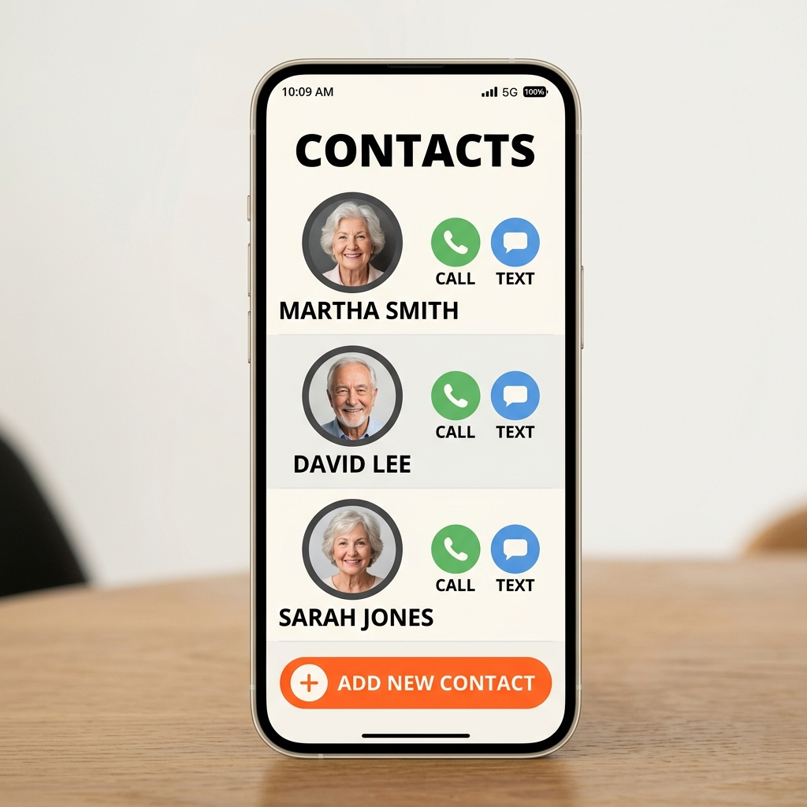
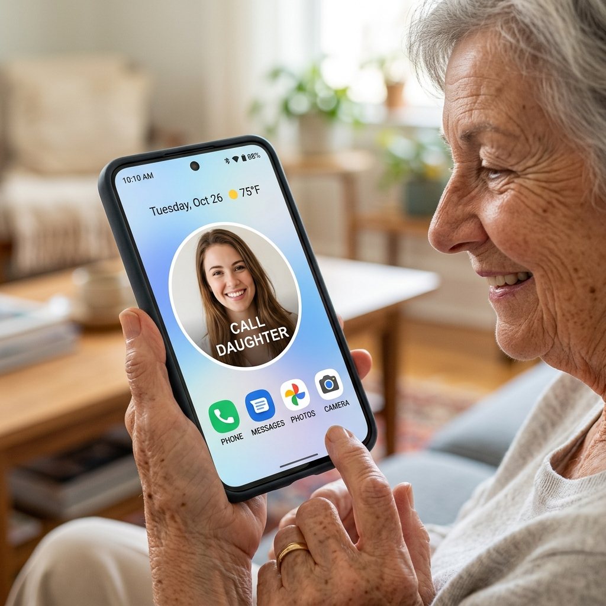

# DirectCall

DirectCall is a Flutter mobile application (for both iOS & Android) specifically designed with accessibility in mind, aimed at making mobile communication effortless for older users. 

Often, navigating through contact lists or reading small caller names can be challenging. DirectCall solves this by allowing users to create simple, highly visible "speed dial" widgets right on their phone's home screen.

## Key Features

- **One-Tap Calling**: No need to open a dialer or browse contacts. Tapping a home screen widget instantly calls the person.
- **Photo-Centric Widgets**: Widgets are designed to display a large photo of the contact, which is much easier to recognize quickly than reading text.
- **Accessible Main App UI**: The app where widgets are configured features high contrast, large touch targets, and clear typography.

## UI/UX Overview

Here is a conceptual look at how DirectCall is designed to be user-friendly:

### 1. Main Application
The main app provides a straightforward interface to manage your speed dial widgets. You can easily see who is already configured and add new contacts.

### 2. Home Screen Widget
Once configured, a large, clear photo widget sits on your phone's home screen. A single tap initiates the call.

## Getting Started

This project is built with Flutter. To run the project locally:

1. Ensure you have [Flutter installed](https://docs.flutter.dev/get-started/install).
2. Clone the repository.
3. Run `flutter pub get` to install dependencies.
4. Run `flutter run` to launch the app on your connected device or emulator.
